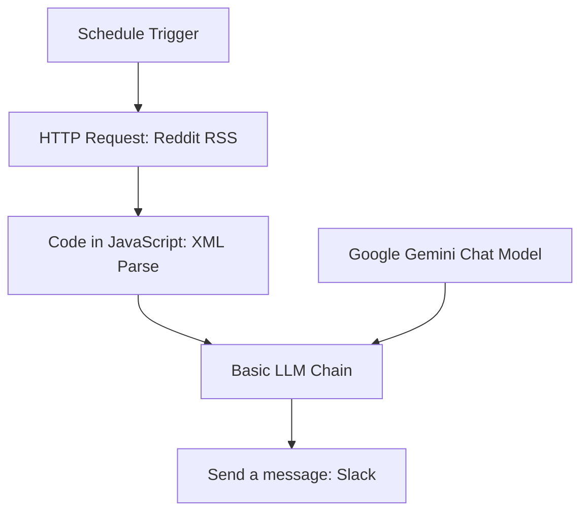

# K-Pop Short-form Trend Hunter

Reddit의 K-Pop 챌린지 글을 수집해서, Gemini로 요약/아이디어를 만들고 Slack으로 보내는 n8n 워크플로우입니다.

---

## 한눈에 보기

- **트리거**: 매일 09:00 스케줄 실행
- **수집**: Reddit RSS (`r/kpop`, `challenge` 검색)
- **가공**: JavaScript 코드 노드에서 XML 파싱/정제
- **분석**: Google Gemini Chat Model + Basic LLM Chain
- **전송**: Slack 채널 메시지

---

## 워크플로우 구조



---

## 현재 구현 기준 기능

- Reddit RSS 요청에 **고정 User-Agent** 사용
- HTTP Request 노드에 **타임아웃(30s) + 재시도(최대 3회)** 설정
- `<entry>`/`<title>`/`<link>`를 정규식으로 파싱
- Gemini 출력은 JSON이 아니라 **마크다운 리포트 텍스트**
- Slack 노드는 기본 채널 `#reddit-test`로 설정

---

## 빠른 시작

### 1) 워크플로우 불러오기

1. n8n에서 **Import from File**
2. `kpop-trend-hunter-workflow.json` 선택

### 2) Credential 연결

- `Google Gemini Chat Model` 노드: Gemini API Credential 연결
- `Send a message` 노드: Slack API Credential 연결

### 3) 실행

- 먼저 **Execute Workflow**로 테스트
- 정상 확인 후 **Active** ON

---

## 설정 포인트

- Reddit 쿼리 변경: `HTTP Request` 노드 URL의 `q=challenge` 수정
- 전송 채널 변경: `Send a message` 노드 `channelId` 변경
- 실행 시간/주기 변경: `Schedule Trigger` 노드 수정

---

## 주의사항 (현재 상태)

- 워크플로우 JSON의 기본 상태는 `"active": false` 입니다.
- User-Agent 로테이션은 구현되어 있지 않고 **고정 문자열 1개**를 사용합니다.
- 데이터 소스는 현재 Reddit RSS 1개 경로 중심입니다.

---

## 파일 구조

```bash
├── kpop-trend-hunter-workflow.json
├── SETUP.md
├── assets/
└── README.md
```
