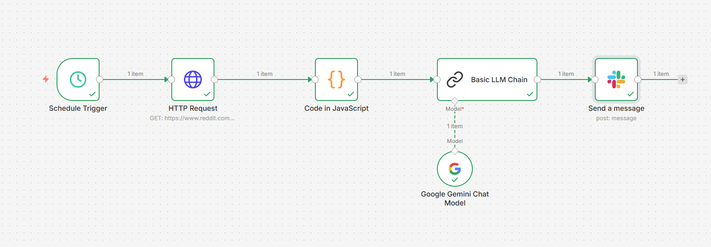
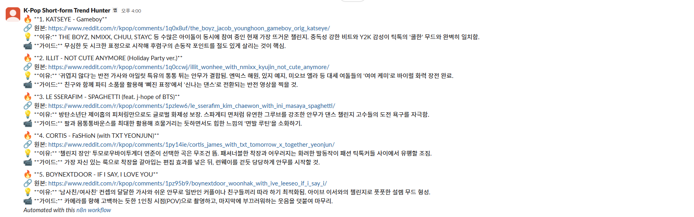

## 📝 프로젝트 소개 (Executive Summary)

> **"매일 아침 K-Pop 숫폼 챌린지 소재를 발굴하여 Slack으로 기획안을 자동 발송합니다."**

**K-Pop Short-form Trend Hunter**은 **엔터사 직원 및 콘텐츠 기획자**를 위한 **자동화 트렌드 모니터링 시스템**입니다. **n8n 워크플로우와 Google Gemini API**를 활용하여 **숏폼 콘텐츠 소재 발굴을 위한 수동 작업**을 해결하고, 결과적으로 **매일 자동으로 바이럴 가능성 높은 K-Pop 챌린지를 선별하여 Slack으로 리포트를 전송**하는 업무 효율성을 제공합니다.

* **제작:** jeonsavvy@gmail.com

---

## ✨ 핵심 기능 (Key Features)

<table>
  <tr>
    <td align="center" width="50%">
      <h3>🔹 RSS 데이터 정제</h3>
      <p>Reddit RSS의 XML 데이터를 JavaScript로 파싱하여 제목과 링크를 추출하고, 구조화된 JSON 객체로 변환합니다.</p>
    </td>
    <td align="center" width="50%">
      <h3>🔹 AI 기반 트렌드 분석</h3>
      <p>Google Gemini API를 활용하여 바이럴 가능성 높은 챌린지를 선별하고, Slack에 최적화된 마크다운 형식의 리포트를 생성합니다.</p>
    </td>
  </tr>
  <tr>
    <td align="center" width="50%">
      <h3>🔹 자동 트렌드 모니터링</h3>
      <p>매일 지정된 시간에 Reddit r/kpop 서브레딧에서 challenge 키워드로 최신 트렌드를 자동 수집합니다.</p>
    </td>
    <td align="center" width="50%">
      <h3>🔹 Slack 자동 리포트</h3>
      <p>마크다운 형식의 리포트를 Slack 채널에 자동 전송합니다.</p>
    </td>
  </tr>
</table>

---

## 🏗 아키텍처 및 워크플로우 (Architecture)

### 🔄 데이터 흐름

1. **수집 (Input):** 매일 지정된 시간에 Reddit RSS 피드(r/kpop, challenge 키워드)에서 데이터 수집
2. **처리 (Process):** XML 파싱 후 Google Gemini API로 바이럴 가능성 높은 챌린지 선별 및 리포트 생성
3. **결과 (Output):** 생성된 리포트를 Slack 채널로 자동 전송

<div align="center">
  
  <br><em>n8n 워크플로우 구조</em>
</div>

---

## 🛠 기술 스택 (Tech Stack)

| 구분 | 기술 |
| :--- | :--- |
| **Workflow Automation** | n8n |
| **AI / ML** | Google Gemini API |
| **Data Source** | Reddit RSS (r/kpop) |
| **Notification** | Slack API |
| **Data Processing** | JavaScript |

---

## 🚀 시작 가이드 (Getting Started)

### 전제 조건 (Prerequisites)

* **n8n 인스턴스** (Self-hosted 또는 n8n Cloud 계정)
* **Google Gemini API Key** ([Google AI Studio](https://makersuite.google.com/app/apikey)에서 발급)
* **Slack Webhook URL** 또는 **Slack Bot Token** (Slack App 생성 필요)

### 설치 및 실행 (Installation)

1. **레포지토리 클론**
   ```bash
   git clone https://github.com/ieonsavvy/K-Pop-Short-form-Trend-Hunter.git
   cd K-Pop-Short-form-Trend-Hunter
   ```

2. **n8n 워크플로우 Import**
   * n8n 대시보드에 로그인
   * 좌측 상단의 **"Workflows"** 메뉴 클릭
   * **"Import from File"** 버튼 클릭
   * `kpop-trend-hunter-workflow.json` 파일 선택

3. **API Key 설정**
   * Google Gemini API Key: [Google AI Studio](https://makersuite.google.com/app/apikey)에서 발급
   * Slack Webhook URL 또는 Bot Token: Slack App 생성 필요
   * 자세한 설정은 [SETUP.md](./SETUP.md) 참고

4. **프로젝트 실행**
   * n8n 대시보드에서 워크플로우의 **"Active"** 토글을 켜기
   * 첫 실행을 위해 **"Execute Workflow"** 버튼으로 테스트 실행
   * 매일 지정된 시간(기본: 오전 9시)에 자동 실행됩니다

---

## 📂 폴더 구조 (Directory Structure)

```bash
├── assets/                           # 이미지 및 정적 파일
│   ├── workflow-diagram.png          # n8n 워크플로우 구조 다이어그램
│   └── slack-demo.png                # Slack 리포트 예시 이미지
├── kpop-trend-hunter-workflow.json   # n8n 워크플로우 설정 파일
├── README.md                         # 프로젝트 문서
└── SETUP.md                          # 상세 설정 가이드
```

---

## 📸 데모 (Demo)

<div align="center">
  
  <br><em>Slack으로 전송되는 트렌드 리포트 예시</em>
</div>

---

## 📚 문서 (Documentation)

- [SETUP.md](./SETUP.md) - 상세 설정 가이드

---
