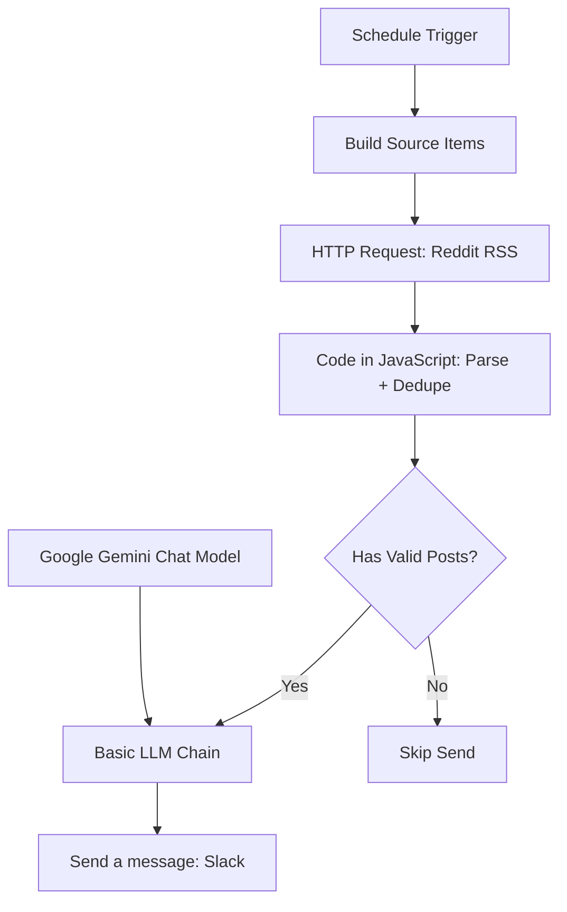

# K-Pop Short-form Bot

케이팝숏폼봇은 Reddit의 K-Pop 챌린지 글을 수집해서, Gemini로 요약/아이디어를 만들고 Slack으로 보내는 n8n 워크플로우입니다.

---

## 한눈에 보기

- **트리거**: 매일 09:00 스케줄 실행
- **수집**: Reddit RSS 다중 소스 (`r/kpop`, `r/kpopthoughts`, `r/kpophelp`)
- **가공**: JavaScript 코드 노드에서 XML 파싱/정제
- **분석**: Google Gemini Chat Model + Basic LLM Chain
- **전송**: Slack 채널 메시지

---

## 워크플로우 구조



---

## 현재 구현 기준 기능

- Reddit RSS 요청을 **다중 소스 아이템**으로 분리해 순회
- User-Agent를 후보 리스트에서 **로테이션**해서 사용
- HTTP Request 노드에 **타임아웃(30s) + 재시도(최대 3회)** 설정
- `<entry>`/`<title>`/`<link>`를 정규식으로 파싱 후 **링크 기준 중복 제거**
- 유효 포스트가 없으면 IF 분기에서 Slack 전송을 **스킵**
- Gemini 출력은 JSON이 아니라 **마크다운 리포트 텍스트**
- Slack 노드는 기본 채널 `#reddit-test`로 설정

---

## 빠른 시작

### 1) 워크플로우 불러오기

1. n8n에서 **Import from File**
2. `kpop-short-form-bot-workflow.json` 선택

### 2) Credential 연결

- `Google Gemini Chat Model` 노드: Gemini API Credential 연결
- `Send a message` 노드: Slack API Credential 연결

### 3) 실행

- 먼저 **Execute Workflow**로 테스트
- 정상 확인 후 **Active** ON

---

## 온보딩(권장) - 10분 체크리스트

### 1) Slack Credential을 먼저 안정화

`Send a message` 노드는 **Slack API + Bot Token (`xoxb-...`)** 기준으로 맞춰져 있습니다.

1. Slack App 생성 또는 기존 App 선택
2. **OAuth & Permissions**에서 Bot Token Scopes 추가
   - `chat:write` (필수)
   - `channels:read` (공개 채널 목록 조회)
   - `groups:read` (비공개 채널 목록 조회)
   - `channels:join` (공개 채널 자동 참가 필요 시)
3. **Install to Workspace / Reinstall** 실행
4. 발급된 `xoxb-...` 토큰으로 n8n의 `Slack API` Credential 생성

> 보안: 토큰은 문서/채팅/커밋에 절대 노출하지 말고, 유출 시 즉시 revoke + 재발급하세요.

### 2) 채널 연결

- 가장 안전한 방법: `Send a message` 노드의 `channelId`를 **채널 ID(`C...` 또는 `G...`)**로 직접 지정
- 채널명 From list가 비어도 ID 직접 입력은 정상 동작할 수 있습니다.
- 봇이 채널에 없으면 Slack에서 `/invite @앱이름` 또는 `conversations.join` 필요

### 3) 첫 실행 전 점검

- `Build Source Items` 출력에 `rss_url`, `user_agent`가 생성되는지 확인
- `Code in JavaScript` 결과에 `post_count`, `should_send` 값 확인
- `should_send = yes`일 때만 Slack 전송되는지 확인

---

## Slack 트러블슈팅 (자주 막히는 케이스)

| 에러/증상 | 원인 | 해결 |
| --- | --- | --- |
| `redirect_uri did not match any configured URIs` | Slack App Redirect URL 미등록/불일치 | Slack OAuth Redirect URL을 n8n callback과 **완전 일치**하게 등록 |
| `not_allowed_token_type` | 토큰 타입 불일치 (`xapp`, `xoxc` 등) | `xoxb-...` Bot token으로 Credential 재생성 |
| From list에 채널이 안 뜸 | `groups:read` 등 목록 조회 scope 부족 | scope 추가 후 **Reinstall to Workspace** |
| `not_in_channel` | 봇이 대상 채널 미참여 | `/invite @앱이름` 또는 `conversations.join` |
| `missing_scope` | 필요한 Slack scope 누락 | 에러의 `needed` 값 확인 후 scope 추가 + reinstall |

---

## 설정 포인트

- 수집 소스/키워드 변경: `Build Source Items` 노드의 `targets` 배열 수정
- User-Agent 후보 변경: `Build Source Items` 노드의 `userAgents` 배열 수정
- 전송 채널 변경: `Send a message` 노드 `channelId` 변경
- 실행 시간/주기 변경: `Schedule Trigger` 노드 수정

---

## 주의사항 (현재 상태)

- 워크플로우 JSON의 기본 상태는 `"active": false` 입니다.
- Reddit RSS XML 구조가 바뀌면 파싱 정규식 수정이 필요할 수 있습니다.
- `Has Valid Posts?` 분기에서 `No` 경로는 알림을 보내지 않도록 설계되어 있습니다.

---

## 파일 구조

```bash
├── kpop-short-form-bot-workflow.json
├── assets/
└── README.md
```
