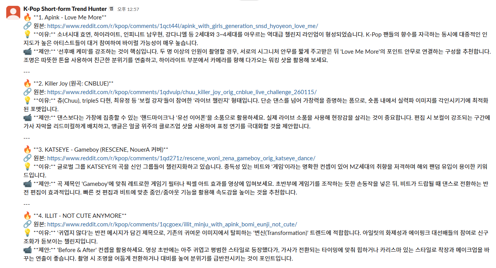
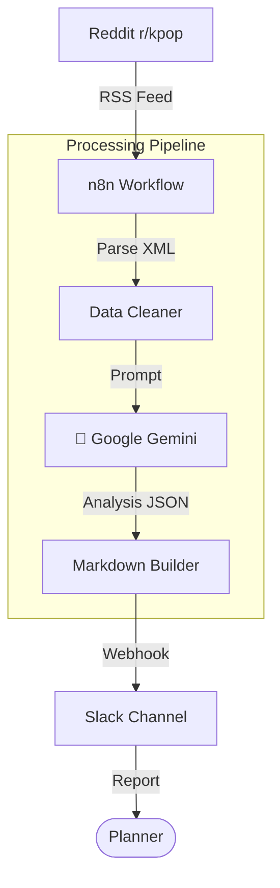

# K-Pop Short-form Trend Hunter

<div align="center">
  
  
  <br />

  
  
  
</div>

<br />

**K-Pop Trend Hunter**는 **n8n 워크플로우**와 **Google Gemini API**를 활용한 숏폼 트렌드 발굴 자동화 시스템입니다.
Reddit 등 해외 커뮤니티에서 K-Pop 관련 데이터를 수집 및 정제한 후, AI가 바이럴 가능성을 분석하여 매일 아침 Slack으로 기획 리포트를 전송합니다.

---

## 🛠 Features

*   **Enhanced RSS Parsing**: Reddit RSS(XML) 데이터를 정규식 기반으로 파싱하여 노이즈 없는 깔끔한 제목/링크 추출
*   **AI Trend Analysis**: Gemini API를 통해 수집된 콘텐츠의 바이럴 소구점(Hook) 및 활용 방안 자동 분석
*   **Anti-blocking Crawling**: User-Agent 로테이션 및 재시도 로직을 적용하여 Reddit의 Bot 차단 우회
*   **Automated Reporting**: 분석된 인사이트를 마크다운 포맷으로 가공하여 Slack 채널로 자동 발송
*   **Zero-Maintenance**: n8n 스케줄러를 통해 서버 관리 없이 완전 자동화된 데이터 파이프라인 구축

---

## 🏗 Architecture



---

## 📦 Tech Stack

| Category | Technology |
| :--- | :--- |
| **Orchestration** | n8n (Self-hosted / Cloud) |
| **AI Model** | Google Gemini API (Pro) |
| **Data Source** | Reddit RSS, External Feeds |
| **Notification** | Slack Incoming Webhook |
| **Scripting** | JavaScript (ES6+) |

---

## 🚀 Getting Started

### Prerequisites
*   n8n Instance
*   Google Gemini API Key
*   Slack Webhook URL

### Installation

1.  **Repository Clone**
    ```bash
    git clone https://github.com/jeonsavvy/K-Pop-Short-form-Trend-Hunter.git
    cd K-Pop-Short-form-Trend-Hunter
    ```

2.  **Import Workflow**
    *   n8n 대시보드 접속 > **Workflows** > **Import from File**
    *   `kpop-trend-hunter-workflow.json` 파일 선택

3.  **Environment Setup**
    *   **Google Gemini**: [AI Studio](https://makersuite.google.com/app/apikey)에서 키 발급 후 n8n Credential 등록
    *   **Slack**: Webhook URL 생성 후 `Slack` 노드에 설정

4.  **Run Workflow**
    *   워크플로우 에디터 상단의 **Execute Workflow** 버튼으로 테스트
    *   **Active** 토글을 켜서 스케줄링 활성화 (기본값: 매일 09:00)

---

## 📂 Directory Structure

```bash
├── assets/                           # Static Assets
├── kpop-trend-hunter-workflow.json   # Main Workflow File
├── SETUP.md                          # Detailed Setup Guide
└── README.md
```
